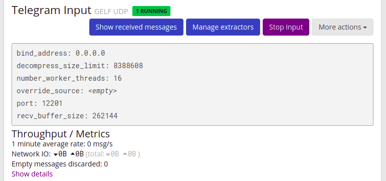
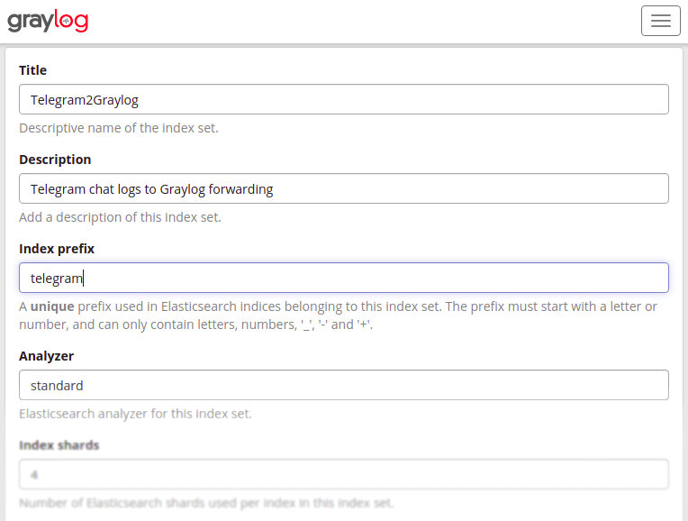
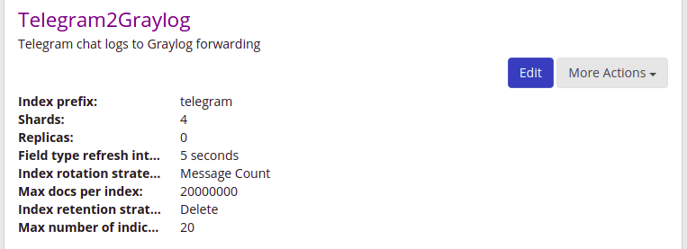
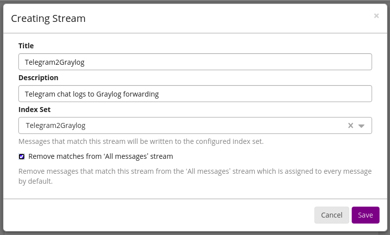
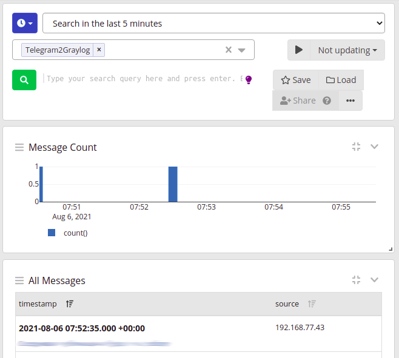

##### Date: 2021/08/21
##### Update: None

# Telegram to Graylog forwarder

## Table of Contents
  * [Architecture](#architecture)
  * [Prerequisites](#prerequisites)
  * [Usage](#usage)
    + [Realtime mode](#realtime-mode)
    + [History mode](#history-mode)
    + [Running with Docker Compose](#running-with-docker-compose)
  * [Graylog Settings](#graylog-settings)
  * [References](#references)

The [Graylog](https://docs.graylog.org/en/latest/index.html) <sup id="a1">[1](#f1)</sup> can be used for analysis of [Telegram](https://telegram.org/) <sup id="a2">[2](#f2)</sup> chat logs. To forward messages from selected chat(s) the specific Python script as transport is implemented.

## Publish Date
* 2021-08-21

## Architecture
Overall integration architecture of the solution is very simple:


The script [telegram_chatlog2graylog.py](https://github.com/freefd/utils/blob/master/telegram_chatlog2graylog.py) <sup id="a0">[0](#f0)</sup> connects to Telegram using API ID and API Hash for existing account. It can also be easily modified to run with Telegram bot credentials as used library supports this feature.

## Prerequisites
 * Install [Graylog](https://docs.graylog.org/en/latest/index.html) <sup id="a1">[1](#f1)</sup>
 * Install [Python 3](https://www.python.org/downloads/) <sup id="a3">[3](#f3)</sup>
 * Install [telethon](https://docs.telethon.dev/en/latest/) <sup id="a4">[4](#f4)</sup> module for Python 3, the MTProto library to interact with Telegram's API
 * Create your own [credentials](https://core.telegram.org/api/obtaining_api_id) <sup id="a5">[5](#f5)</sup>

## Usage
The forwarder script  has been designed to run in interactive or service approach. It also supports `history` and `realtime` modes:
 * `history` mode will collect users text messages from selected chats, convert to [GELF](https://docs.graylog.org/en/latest/pages/gelf.html) <sup id="a6">[6](#f6)</sup> format and immediately send to Graylog input.

   > *Note*: This mode works within a single thread and doesn't parallelize message processing to not overload Graylog GELF input's queue. It can cause long time delivery of requested messages for chats with a very long history.

 * `realtime` mode listens for new text messages from chats which were provided as list of peers, converts each message to GELF format and immediately sends it to Graylog input.

   > *Note*: Script will process all available chats if the list is not provided.

Available arguments are:
  * `--phone PHONE`<br/>`-ph PHONE`

    Registered phone number. `CHATLOG2GRAYLOG_PHONE` environment variable will also work.

    Default: **0**
  * `--api-id API_ID`<br/>`-id API_ID`

    Telegram API ID. `CHATLOG2GRAYLOG_API_ID` environment variable will also work.

    Default: **0**
  * `--api-hash API_HASH`<br/>`-hash API_HASH`

    Telegram API Hash. `CHATLOG2GRAYLOG_API_HASH` environment variable will also work.

    Default: **not set**
  * `--until UNTIL`<br/>`-u UNTIL`

    Datetime in format `YYYY-MM-DD`. `CHATLOG2GRAYLOG_UNTIL` environment variable will also work.

    Default: **not set**
  * `--verbose`<br/>`-v`

    Enable verbose output. `CHATLOG2GRAYLOG_LOG_LEVEL` environment variable will also work.

    Default: **0**
  * `--mode {realtime,history}`<br/>`-m {realtime,history}`

    Operating mode, constaints are `realtime` and `history`. `CHATLOG2GRAYLOG_MODE` environment variable will also work.

    Default: **realtime**
  * `--graylog-host GRAYLOG_HOST`<br/>`-gh GRAYLOG_HOST`

    Graylog host to forward messages. `CHATLOG2GRAYLOG_HOST` environment variable will also work.

    Default: **not set**
  * `--graylog-port GRAYLOG_PORT`<br/>`-gp GRAYLOG_PORT`

    Graylog GELF input port. `CHATLOG2GRAYLOG_GRAYLOG_PORT` environment variable will also work. Default: 12201

    Default: **12201**
  * `--peers PEERS [PEERS ...]`<br/>`-p PEERS [PEERS ...]`

    List of chat peer IDs for realtime mode. `CHATLOG2GRAYLOG_PEERS` environment variable will also work.

    Default: **not set**


### Realtime mode
The example on how to execute the script wordy for `realtime` mode:
```
$ ./telegram_chatlog2graylog.py --phone 79123456789 --api-id 123456 --api-hash a622ddd7244a59b9c12be4e762a133df --graylog-host 192.168.77.42 -vv
[2021-08-05 01:42:19,232] DEBUG: Running Mode: realtime
[2021-08-05 01:42:19,233] DEBUG: Using selector: EpollSelector
[2021-08-05 01:42:19,234] INFO: Connecting to 149.154.167.51:443/TcpFull...
[2021-08-05 01:42:19,234] DEBUG: Connection attempt 1...
[2021-08-05 01:42:19,292] DEBUG: Connection success!
[2021-08-05 01:42:19,293] DEBUG: Starting send loop
[2021-08-05 01:42:19,293] DEBUG: Starting receive loop
[2021-08-05 01:42:19,293] INFO: Connection to 149.154.167.51:443/TcpFull complete!
[2021-08-05 01:42:19,305] DEBUG: Waiting for messages to send...

... omitted for brevity ...

[2021-08-05 01:42:19,567] DEBUG: Assigned msg_id = 6992709009337356152 to MsgsAck (7fb28bdf91c0)
[2021-08-05 01:42:19,567] DEBUG: Encrypting 1 message(s) in 36 bytes for sending
[2021-08-05 01:42:19,567] DEBUG: Encrypted messages put in a queue to be sent
[2021-08-05 01:42:19,567] DEBUG: Waiting for messages to send...
[2021-08-05 01:42:19,637] DEBUG: Handling RPC result for message 6992709009331908764
[2021-08-05 01:42:19,637] DEBUG: Receiving items from the network...

...
```

### History mode
The another example for verbosely execution in `history` mode:
```
$ ./telegram_chatlog2graylog.py --phone 79123456789 --api-id 123456 --api-hash a622ddd7244a59b9c12be4e762a133df --graylog-host 192.168.77.42 --mode history --until 1970-01-01 -vv
[2021-08-05 01:47:46,290] DEBUG: Running Mode: history
[2021-08-05 01:47:46,291] DEBUG: Using selector: EpollSelector
[2021-08-05 01:47:46,293] INFO: Connecting to 149.154.167.51:443/TcpFull...
[2021-08-05 01:47:46,293] DEBUG: Connection attempt 1...
[2021-08-05 01:47:46,349] DEBUG: Connection success!
[2021-08-05 01:47:46,349] DEBUG: Starting send loop
[2021-08-05 01:47:46,349] DEBUG: Starting receive loop
[2021-08-05 01:47:46,349] INFO: Connection to 149.154.167.51:443/TcpFull complete!
[2021-08-05 01:47:46,366] DEBUG: Waiting for messages to send...

... omitted for brevity ...

0. [All Peers]
1. chat1 (Peer 1012345678)
2. chat2 (Peer 1087654321)

[INPUT] Choose chat: 1
[2021-08-05 01:47:50,584] INFO: Chosen: chat1
[2021-08-05 01:47:50,585] INFO: Peer: chat1
[2021-08-05 01:47:50,585] INFO: Getting messages from peer 1012345678 until the date 1970-01-01 00:00:00...
[2021-08-05 01:47:50,686] DEBUG: Assigned msg_id = 6992710431449439264 to SearchRequest (7f0ff65658b0)

... omitted for brevity ...

[2021-08-05 01:47:50,945] DEBUG: Handling RPC result for message 6992710431449439264
[2021-08-05 01:47:50,959] DEBUG: Receiving items from the network...
[2021-08-05 01:47:50,961] INFO: Received: 100 messages. Offset: 0.
[2021-08-05 01:47:51,062] DEBUG: Assigned msg_id = 6992710433248198368 to SearchRequest (7f0ff65658e0)
[2021-08-05 01:47:51,063] DEBUG: Encrypting 1 message(s) in 80 bytes for sending
[2021-08-05 01:47:51,063] DEBUG: Encrypted messages put in a queue to be sent
[2021-08-05 01:47:51,064] DEBUG: Waiting for messages to send...

... omitted for brevity ...

[2021-08-05 01:47:51,204] INFO: Received: 100 messages. Offset: 100.
[2021-08-05 01:47:51,305] DEBUG: Assigned msg_id = 6992710434221231320 to SearchRequest (7f0ff6507130)
[2021-08-05 01:47:51,306] DEBUG: Encrypting 1 message(s) in 80 bytes for sending
[2021-08-05 01:47:51,307] DEBUG: Encrypted messages put in a queue to be sent
[2021-08-05 01:47:51,307] DEBUG: Waiting for messages to send...

... omitted for brevity ...

[2021-08-05 01:47:51,479] INFO: Received: 100 messages. Offset: 200.

... omitted for brevity ...

[2021-08-05 01:50:49,650] INFO: Send messages one by one: 192.168.77.1 via 12201/UDP
[2021-08-05 01:50:49,653] DEBUG: New raw message: Message(id=1234567, peer_id=PeerChannel(channel_id=1012345678), date=datetime.datetime(2021, 8, 4, 6, 12, 31, tzinfo=datetime.timezone.utc), message="@Username's rating is now 42", out=False, mentioned=False, media_unread=False, silent=False, post=False, from_scheduled=False, legacy=False, edit_hide=False, pinned=False, from_id=PeerUser(user_id=30123456), fwd_from=None, via_bot_id=None, reply_to=None, media=None, reply_markup=None, entities=[MessageEntityMention(offset=0, length=17)], views=None, forwards=None, replies=MessageReplies(replies=0, replies_pts=272769, comments=False, recent_repliers=[], channel_id=None, max_id=None, read_max_id=None), edit_date=None, post_author=None, grouped_id=None, restriction_reason=[], ttl_period=None)
[2021-08-05 01:50:49,654] DEBUG: Assigned msg_id = 6992711200120490572 to GetUsersRequest (7f934d04e100)
[2021-08-05 01:50:49,655] DEBUG: Encrypting 1 message(s) in 44 bytes for sending
[2021-08-05 01:50:49,656] DEBUG: Encrypted messages put in a queue to be sent
[2021-08-05 01:50:49,656] DEBUG: Waiting for messages to send...

... omitted for brevity ...

[2021-08-05 01:50:49,786] DEBUG: Sending parsed message: {'version': '1.1', 'channel_title': 'chat1', 'channel_id': -1001012345678, 'sender_id': 30123456, 'sender_username': 'someunknownbot', 'sender_firstname': 'Bot', 'sender_lastname': None, 'timestamp': 1628057551, 'message_id': 1234567, 'full_message': "@Username's rating is now 42", 'short_message': "@Username's rating is now 42", 'host': '192.168.77.42'} to 192.168.77.42:12201

...
```

### Running with Docker Compose
You can simply run script as service by [Docker Compose](https://docs.docker.com/compose/) <sup id="a7">[7](#f7)</sup>. Directory structure:

```bash
...

├── .env
├── chatlog2graylog_source
│   ├── build
│   │   ├── Dockerfile
│   │   └── telegram_chatlog2graylog.py
│   └── chatlog2graylog-config
└── docker-compose.yaml
```
A part of sample `docker-compose.yaml` where container with Telegram chat log to Graylog service is defined:

```yaml
...

services:

... omitted for brevity ...

  telegram_chatlog2graylog:
    container_name: telegram_chatlog2graylog
    build:
      context: chatlog2graylog_source
      dockerfile: /path/to/chatlog2graylog_source/build/Dockerfile
    restart: unless-stopped
    networks:
      networkname:
        ipv4_address: 192.168.77.43
    environment:
      CHATLOG2GRAYLOG_PHONE: ${CHATLOG2GRAYLOG_PHONE}
      CHATLOG2GRAYLOG_API_ID: ${CHATLOG2GRAYLOG_API_ID}
      CHATLOG2GRAYLOG_API_HASH: ${CHATLOG2GRAYLOG_API_HASH}
      CHATLOG2GRAYLOG_GRAYLOG_HOST: ${CHATLOG2GRAYLOG_GRAYLOG_HOST}
      CHATLOG2GRAYLOG_LOG_LEVEL: ${CHATLOG2GRAYLOG_LOG_LEVEL}
    volumes:
      - /path/to/chatlog2graylog_source/chatlog2graylog-config/telegram_chatlog2graylog.session:/tmp/telegram_chatlog2graylog.session

...
```
The [.env](https://docs.docker.com/compose/environment-variables/) <sup id="a8">[8](#f8)</sup> file:
```bash
...

# Telegram Chatlog to Graylog
CHATLOG2GRAYLOG_PHONE=79123456789
CHATLOG2GRAYLOG_API_ID=123456
CHATLOG2GRAYLOG_API_HASH=a622ddd7244a59b9c12be4e762a133df
CHATLOG2GRAYLOG_GRAYLOG_HOST=192.168.77.42
CHATLOG2GRAYLOG_LOG_LEVEL=0

...
```
[Dockerfile](https://docs.docker.com/engine/reference/builder/) <sup id="a9">[9](#f9)</sup> content:
```docker
FROM alpine:latest

RUN apk --update add python3 py3-pip && pip3 install telethon

COPY build/telegram_chatlog2graylog.py /usr/local/bin/

CMD ["python3","/usr/local/bin/telegram_chatlog2graylog.py"]
```

Before script can work as service, to create a session file is required. How to start:
* Invoke `docker-compose build` to build the image:
  ```bash
  $ docker-compose build
  ...

  Building telegram_chatlog2graylog
  Step 1/4 : FROM alpine:latest
  ---> d4ff818577bc
  Step 2/4 : RUN apk --update add python3 py3-pip && pip3 install telethon
  ---> Running in cfaa6badf7f6
  fetch https://dl-cdn.alpinelinux.org/alpine/v3.14/main/x86_64/APKINDEX.tar.gz
  fetch https://dl-cdn.alpinelinux.org/alpine/v3.14/community/x86_64/APKINDEX.tar.gz
  (1/38) Installing libbz2 (1.0.8-r1)

  ... omitted for brevity ...

  Successfully installed pyaes-1.6.1 pyasn1-0.4.8 rsa-4.7.2 telethon-1.23.0
  Removing intermediate container cfaa6badf7f6
  ---> b1b28d71ec0d
  Step 3/4 : COPY build/telegram_chatlog2graylog.py /usr/local/bin/
  ---> d686cb99e49a
  Step 4/4 : CMD ["python3","/usr/local/bin/telegram_chatlog2graylog.py"]
  ---> Running in 41c3515d8465
  Removing intermediate container 41c3515d8465
  ---> fc9c94a76ce4
  Successfully built fc9c94a76ce4
  Successfully tagged graylog_telegram_chatlog2graylog:latest
  ```
* Run built docker image to generate session file
  ```
  # docker run --rm -ti -v /docker/graylog/chatlog2graylog_source/chatlog2graylog-config:/tmp --network=0ipvlan20 --ip=192.168.77.43 graylog_telegram_chatlog2graylog:latest ash
  / # python3 /usr/local/bin/telegram_chatlog2graylog.py -ph 79123456789 -id 123456 -hash a622ddd7244a59b9c12be4e762a133df -gh 127.0.0.1
  Please enter the code you received: 12345
  Signed in successfully as Username
  ^C
  ```
* Start as service using `docker-compose up -d`
  ```
  $ docker-compose up -d
  ...
  Creating telegram_chatlog2graylog ... done
  ...
  ```
  And check that container is up and running
  ```json
  $ docker ps -f name=telegram_chatlog2graylog --no-trunc --format '{{ json .}}' | jq .
  {
    "Command": "\"python3 /usr/local/bin/telegram_chatlog2graylog.py\"",
    "CreatedAt": "2021-08-06 02:11:34 +0300 MSK",
    "ID": "253c0003c8b2fd81f7c3bf90090f50c0fc5db7282acc39d5bdffc6da818ac9d6",
    "Image": "graylog_telegram_chatlog2graylog",

    ...

    "Names": "telegram_chatlog2graylog",
    "Networks": "networkname",
    "Ports": "",
    "RunningFor": "23 seconds ago",
    "Size": "4.62kB (virtual 78.5MB)",
    "State": "running",
    "Status": "Up 22 seconds"
  }
  ```
## Graylog Settings
By the assumption that IP address of host with script is known in advance, the approach with dedicated [Stream](https://docs.graylog.org/en/latest/pages/streams.html) <sup id="a10">[10](#f10)</sup> in Graylog will be applied.

* Create new GELF UDP input

  

* Check GELF UDP input is up and running

  

* Create dedicated `Telegram2Graylog` index.

  

* Check the index has been created.

  

* Create corresponding `Telegram2Graylog` stream with `Telegram2Graylog` selected index and remove it from matches for `All messages` stream.

  

* Add match rule based on `source` field to newly create `Telegram2Graylog` stream.

  

* Do not forget to run stream.

  

* Start script and check that messages are coming.

  

## References
<b id="f0">0</b>. [Script telegram_chatlog2graylog.py](https://github.com/freefd/utils/blob/master/telegram_chatlog2graylog.py) [↩](#a0)<br/>
<b id="f1">1</b>. [Graylog](https://docs.graylog.org/en/latest/index.html) [↩](#a1)<br/>
<b id="f2">2</b>. [Telegram](https://telegram.org/) [↩](#a2)<br/>
<b id="f3">3</b>. [Python 3](https://www.python.org/downloads/) [↩](#a3)<br/>
<b id="f4">4</b>. [Telethon module for Python 3](https://docs.telethon.dev/en/latest/) [↩](#a4)<br/>
<b id="f5">5</b>. [Create credentials for Telegram applicaion](https://core.telegram.org/api/obtaining_api_id) [↩](#a5)<br/>
<b id="f6">6</b>. [Graylog Extended Log Format](https://docs.graylog.org/en/latest/pages/gelf.html) [↩](#a6)<br/>
<b id="f7">7</b>. [Docker Compose](https://docs.docker.com/compose/) [↩](#a7)<br/>
<b id="f8">8</b>. [Environment variables in Docker Compose](https://docs.docker.com/compose/environment-variables/) [↩](#a8)<br/>
<b id="f9">9</b>. [Dockerfile reference](https://docs.docker.com/engine/reference/builder/) [↩](#a9)<br/>
<b id="f10">10</b>. [Graylog Streams](https://docs.graylog.org/en/latest/pages/streams.html) [↩](#a10)<br/>