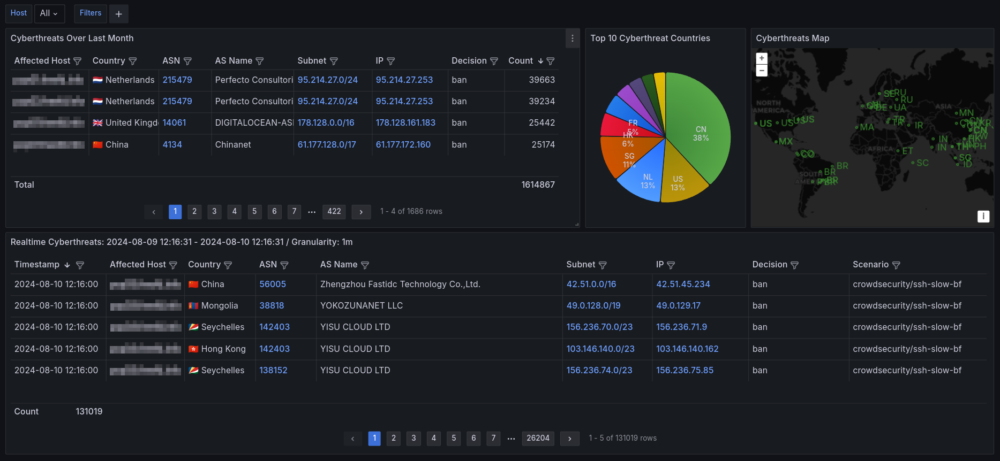
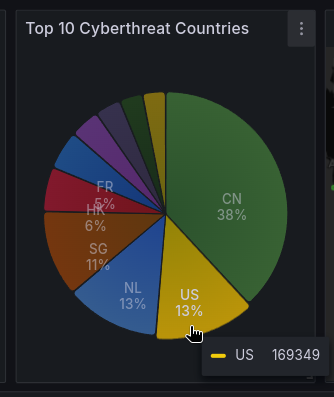
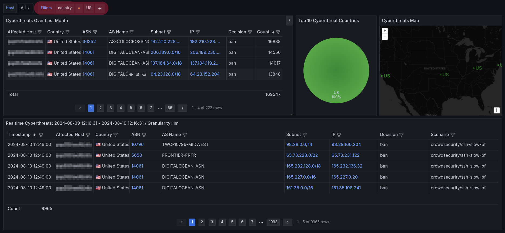
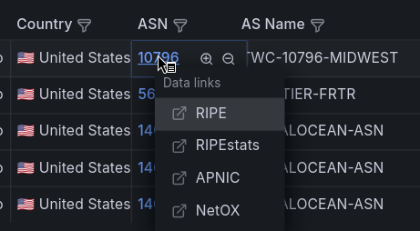
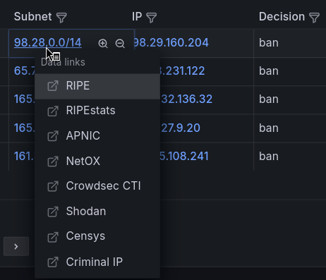
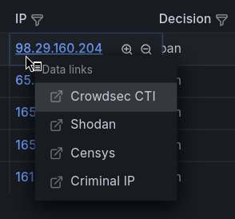
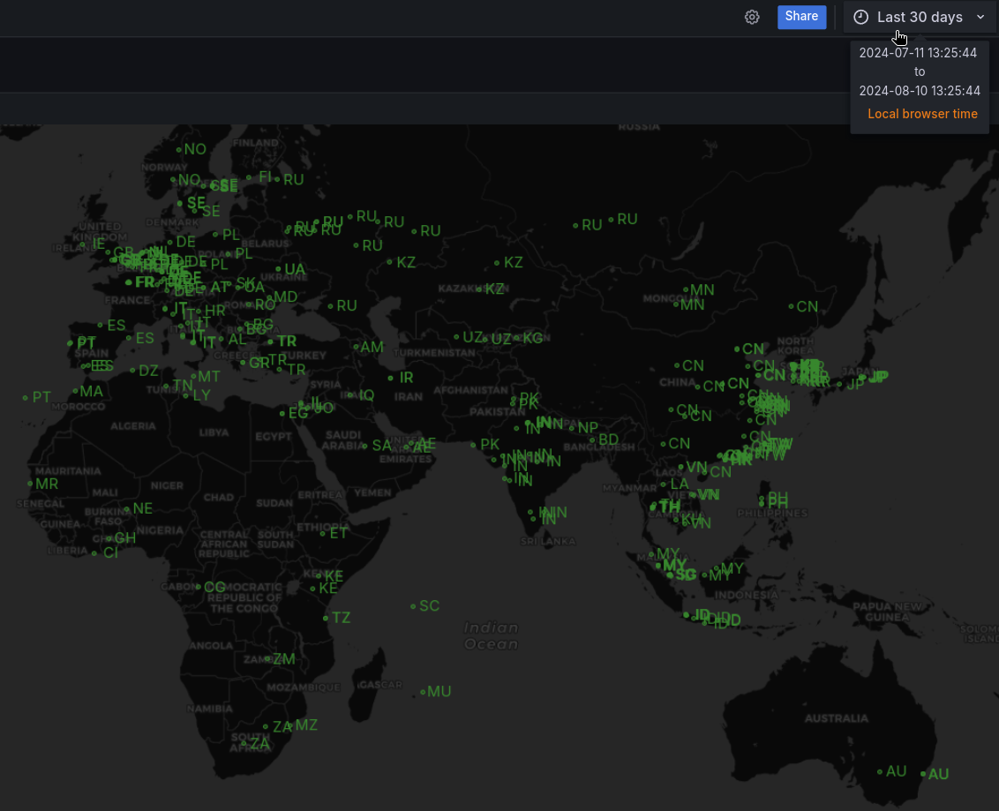
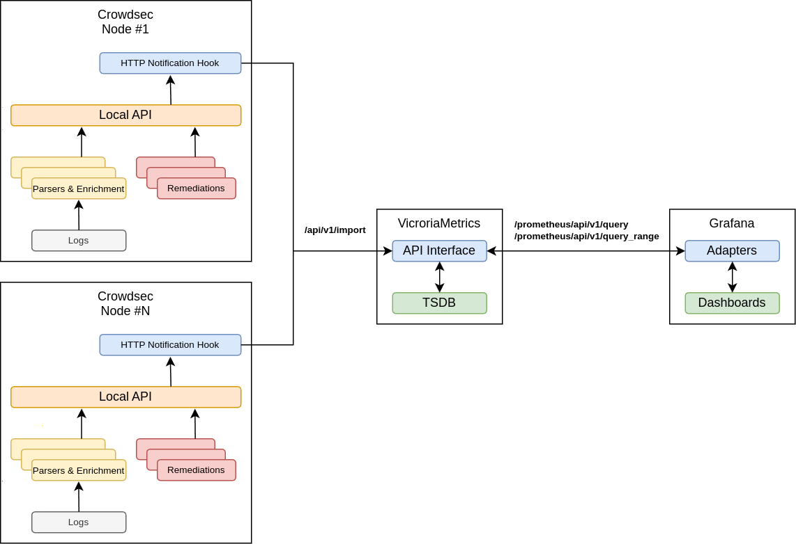
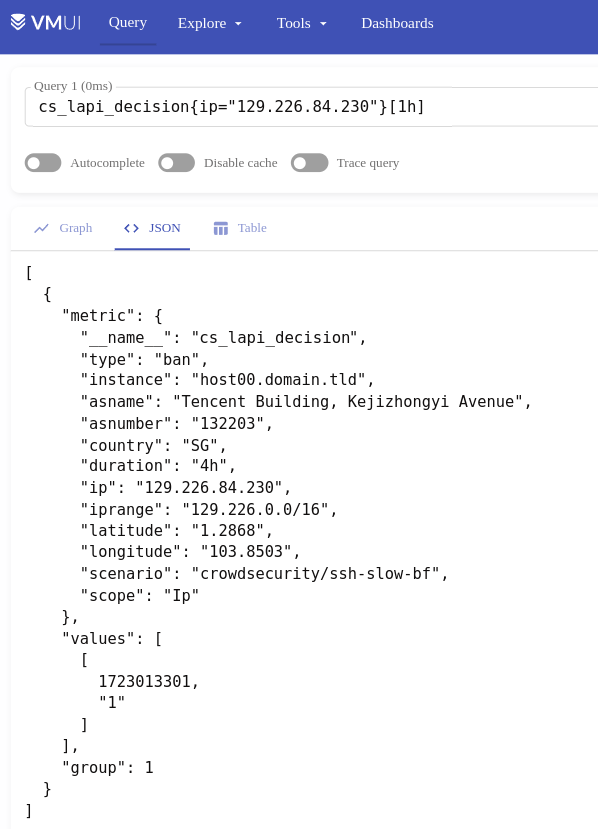

# Cyber threat insights with Crowdsec, VictoriaMetrics and Grafana

- [Publish Date](#publish-date)
- [Weakness in Crowdsec OpenMetrics statistics](#weakness-in-crowdsec-openmetrics-statistics)
- [Different solution](#different-solution)
- [References](#references)

Brewing a low-coding open source cyber threats analysis solution based on [Crowdsec](https://www.crowdsec.net/) <sup id="a1">[1](#f1)</sup>, [VictoriaMetrics](https://victoriametrics.com/) <sup id="a2">[2](#f2)</sup>, and [Grafana](https://grafana.com/) <sup id="a3">[3](#f3)</sup>.

## Publish Date
* 2024-08-10

## Weakness in Crowdsec OpenMetrics statistics
Out of the box, each Crowdsec instance can provide the statistics in the [Prometheus](https://prometheus.io/) <sup id="a4">[4](#f4)</sup> or [OpenMetrics](https://openmetrics.io/) <sup id="a5">[5](#f5)</sup> format about its engine status, such as:
* decisions
* alerts
* etc.

All possible data slices are explained in the [Crowdec metrics documentation](https://docs.crowdsec.net/docs/observability/prometheus/) <sup id="a6">[6](#f6)</sup>. There are official [Grafana dashboards for Crowdsec](https://grafana.com/grafana/dashboards/19011-crowdsec-insight/) <sup id="a7">[7](#f7)</sup>, but these metrics do not contain the information that most operators are interested in, such as cyber threat statistics. For example, active decisions and alerts  contain only the scenario metrics:

```bash
~> curl -s localhost:6060/metrics | egrep 'cs_alerts{|cs_active_decisions{'
cs_active_decisions{action="ban",origin="crowdsec",reason="crowdsecurity/ssh-bf"} 1
cs_alerts{reason="crowdsecurity/ssh-bf"} 24
cs_alerts{reason="crowdsecurity/ssh-bf_user-enum"} 5
cs_alerts{reason="crowdsecurity/ssh-slow-bf"} 11
```

To obtain cyber threat statistics, Crowdsec requires the use of [Console](https://docs.crowdsec.net/u/console/intro) <sup id="a8">[8](#f8)</sup> as the central management system:


Also, the [Metabase](https://www.metabase.com/) <sup id="a9">[9](#f9)</sup> can provide this statistics with [cscli dashboard](https://docs.crowdsec.net/docs/observability/dashboard) <sup id="a10">[10](#f10)</sup>:


The 1<sup>st</sup> option requires binding to the centralized Crowdsec ecosystem and feeding it with enterprise infrastructure data, the 2<sup>nd</sup> requires to start Metabase on every existing Crowdsec node and looks mostly unmanageable.

## Different solution
The other self-hosted [low-code](https://en.wikipedia.org/wiki/Low-code_development_platform) <sup id="a11">[11](#f11)</sup> solution with the almost same results can be reached by integration of Crowdsec with VictoriaMetrics. Later the stored data easily can be represented in Grafana:




You can download this dashboard at [Grafana dashboards](https://grafana.com/grafana/dashboards/21689).

There are also available all powerful Grafana controls for the analysis:
* Data filtering
* Data links
* Value Mapping
* etc.

For example, dynamic filtering the entire dashboard by a single country simply clicking on chart:





Additional data links are helping with analysis of a particular ASN record with information from [RIRs](https://en.wikipedia.org/wiki/Regional_Internet_registry) <sup id="a12">[12](#f12)</sup>:



The subnet information could be investigated by both information from RIR and online security databases such as [Crowdsec CTI](https://www.crowdsec.net/cyber-threat-intelligence) <sup id="a13">[13](#f13)</sup>, [Shodan](https://www.shodan.io/) <sup id="a14">[14](#f14)</sup>, [Censys](https://censys.com/) <sup id="a15">[15](#f15)</sup>, [Criminal IP](https://www.criminalip.io/) <sup id="a16">[16](#f16)</sup>, and similar:



The IP address can only be analyzed with online security databases:



Also there is a geomap with coordinates found by the [built-in Crowdsec GeoIP module](https://app.crowdsec.net/hub/author/crowdsecurity/configurations/geoip-enrich) <sup id="a17">[17](#f17)</sup> based on [Maxmind Lite](https://dev.maxmind.com/geoip/geolite2-free-geolocation-data) <sup id="a18">[18](#f18)</sup> databases.



## Integration steps
Overall integration and call-flow landscape can be depicted as follows:



As shown above, the [/api/v1/import](https://docs.victoriametrics.com/url-examples/#apiv1import) <sup id="a19">[19](#f19)</sup> endpoint on VictoriaMetrics instance is utilized to collect the data from Crowdsec nodes, it accepts [JSON Lines](https://jsonlines.org/) <sup id="a20">[20](#f20)</sup> text format.

The coding skills are not required to make all this work, only the template configuration for [Crowdsec HTTP notification plugin](https://docs.crowdsec.net/docs/notification_plugins/http) <sup id="a21">[21](#f21)</sup> is needed within the `/path/to/notifications/http.yaml` file:


```yaml
type: http
name: http_default
log_level: info
format: >
  {{- range $Alert := . -}}
  {{- range .Decisions -}}
  {"metric":{"__name__":"<METRIC_NAME>","instance":"<INSTANCE_NAME>","country":"{{$Alert.Source.Cn}}","asname":"{{$Alert.Source.AsName}}","asnumber":"{{$Alert.Source.AsNumber}}","latitude":"{{$Alert.Source.Latitude}}","longitude":"{{$Alert.Source.Longitude}}","iprange":"{{$Alert.Source.Range}}","scenario":"{{.Scenario}}","type":"{{.Type}}","duration":"{{.Duration}}","scope":"{{.Scope}}","ip":"{{.Value}}"},"values": [1],"timestamps":[{{now|unixEpoch}}000]}
  {{- end }}
  {{- end -}}
url: <VICTORIAMETRICS_INSTANCE_PROTO>://<VICTORIAMETRICS_INSTANCE>/api/v1/import
method: POST
headers:
  Content-Type: application/json
  Authorization: "<AUTH_STRING>"
```


Where `<VAR_NAME>` are placeholders required to be filled with real data:
* `<METRIC_NAME>` - the name of the metric being produced, the current implementation contains `cs_lapi_decision`.
* `<INSTANCE_NAME>` - the name of the instance that sends this data, e.g. `host00.domain.tld`.
* `<VICTORIAMETRICS_INSTANCE_PROTO>` - the VictoriaMetrics instance's API protocol, `http` or `https`.
* `<VICTORIAMETRICS_INSTANCE>` - domain name or IP of the VictoriaMetrics instance.
* `<AUTH_STRING>` - the contents of the [Authorization header](https://developer.mozilla.org/en-US/docs/Web/HTTP/Headers/Authorization) <sup id="a22">[22](#f22)</sup>, for example, could be [Basic Authorization](https://developer.mozilla.org/en-US/docs/Web/HTTP/Headers/Authorization#basic) <sup id="a23">[23](#f23)</sup> or [OAuth2 Bearer](https://oauth.net/2/) <sup id="a24">[24](#f24)</sup>. If authorization does not require, the entire `Authorization` header needs to be removed from template.

Each time the template produces a value of `1`, which means one record. This is the trick of converting `Log` records to `Metric` records. For more information on observability signals please read [Observability Whitepaper](https://github.com/cncf/tag-observability/blob/main/whitepaper.md#observability-signals) <sup id="a25">[25](#f25)</sup>.

And since the value is `1` each time, it's easy to count, summarize, and perform other simple math operations for these records.

Finally, the following example JSON payload will be rendered by this template as a <b>single line</b>, since it strictly needs to be compatible with JSON Lines, here it is formatted for clarity:
```json
{
    "metric": {
        "__name__": "cs_lapi_decision",
        "instance": "host00.domain.tld",
        "country": "SG",
        "asname": "Tencent Building, Kejizhongyi Avenue",
        "asnumber": "132203",
        "latitude": "1.2868",
        "longitude": "103.8503",
        "iprange": "129.226.0.0/16",
        "scenario": "crowdsecurity/ssh-slow-bf",
        "type": "ban",
        "duration": "4h",
        "scope": "Ip",
        "ip": "129.226.84.230"
    },
    "values": [1],
    "timestamps": [1723013301000]
}
```

In VictoriaMertics, this will be shown as a sample of `cs_lapi_decision` time series:



Please do not forget to enable HTTP notifications plugin in the main Crowdsec configuration `config.yaml`:
```yaml
...
config_paths:
  ...
  notification_dir: /path/to/notifications/
  ...
api:
  ...
  server:
    ...
    profiles_path: /path/to/profiles.yaml
...
```

and `profiles.yaml`:
```yaml
...
notifications:
  ...
  - http_default
  ...
...
```

## References
<b id="f1">1</b>. [Crowdsec - Real-time & crowdsourced protection against aggressive IPs](https://www.crowdsec.net/) [↩](#a1)<br/>
<b id="f2">2</b>. [VictoriaMetrics - High-performance, open source time series database & monitoring solution](https://victoriametrics.com/) [↩](#a2)<br/>
<b id="f3">3</b>. [Grafana - Multi-platform open source analytics and interactive visualization web application](https://grafana.com/) [↩](#a3)<br/>
<b id="f4">4</b>. [Prometheus - Open source systems monitoring and alerting toolkit](https://prometheus.io/) [↩](#a4)<br/>
<b id="f5">5</b>. [OpenMetrics - Standard for transmitting cloud-native metrics at scale](https://openmetrics.io/) [↩](#a5)<br/>
<b id="f6">6</b>. [Crowdec metrics documentation](https://docs.crowdsec.net/docs/observability/prometheus/) [↩](#a6)<br/>
<b id="f7">7</b>. [Grafana dashboards for Crowdsec](https://grafana.com/grafana/dashboards/19011-crowdsec-insight/) [↩](#a7)<br/>
<b id="f8">8</b>. [CrowdSec Console - Central management web interface](https://docs.crowdsec.net/u/console/intro) [↩](#a8)<br/>
<b id="f9">9</b>. [Metabase - Open source business intelligence platform](https://www.metabase.com/) [↩](#a9)<br/>
<b id="f10">10</b>. [cscli dashboard](https://docs.crowdsec.net/docs/observability/dashboard) [↩](#a10)<br/>
<b id="f11">11</b>. [low-code - Mostly visual approach to software development](https://en.wikipedia.org/wiki/Low-code_development_platform) [↩](#a11)<br/>
<b id="f12">12</b>. [RIR - Regional Internet registry](https://en.wikipedia.org/wiki/Regional_Internet_registry) [↩](#a12)<br/>
<b id="f13">13</b>. [Crowdsec CTI - OSINT search engine specialized in attack surface assessment and threat hunting](https://www.crowdsec.net/cyber-threat-intelligence) [↩](#a13)<br/>
<b id="f14">14</b>. [Shodan - OSINT search engine specialized in attack surface assessment and threat hunting](https://www.shodan.io/) [↩](#a14)<br/>
<b id="f15">15</b>. [Censys - OSINT search engine specialized in attack surface assessment and threat hunting](https://censys.com/) [↩](#a15)<br/>
<b id="f16">16</b>. [Criminal IP - OSINT search engine specialized in attack surface assessment and threat hunting](https://www.criminalip.io/) [↩](#a16)<br/>
<b id="f17">17</b>. [Crowdsec GeoIP module - GeoIP module relies on geolite database to provide enrichment on source ip](https://app.crowdsec.net/hub/author/crowdsecurity/configurations/geoip-enrich) [↩](#a17)<br/>
<b id="f18">18</b>. [Maxmind Lite - Less accurate free IP geolocation databases](https://dev.maxmind.com/geoip/geolite2-free-geolocation-data) [↩](#a18)<br/>
<b id="f19">19</b>. [Import data to VictoriaMetrics in JSON line format](https://docs.victoriametrics.com/url-examples/#apiv1import) [↩](#a19)<br/>
<b id="f20">20</b>. [JSON Lines - Convenient format for storing structured data that may be processed one record at a time](https://jsonlines.org/) [↩](#a20)<br/>
<b id="f21">21</b>. [Crowdsec HTTP notification plugin](https://docs.crowdsec.net/docs/notification_plugins/http) [↩](#a21)<br/>
<b id="f22">22</b>. [HTTP Authorization header](https://developer.mozilla.org/en-US/docs/Web/HTTP/Headers/Authorization) [↩](#a22)<br/>
<b id="f23">23</b>. [HTTP Basic Authorization](https://developer.mozilla.org/en-US/docs/Web/HTTP/Headers/Authorization#basic) [↩](#a23)<br/>
<b id="f24">24</b>. [HTTP OAuth2 Authentication](https://oauth.net/2/) [↩](#a24)<br/>
<b id="f25">25</b>. [Observability Whitepaper](https://github.com/cncf/tag-observability/blob/main/whitepaper.md#observability-signals) [↩](#a25)<br/>